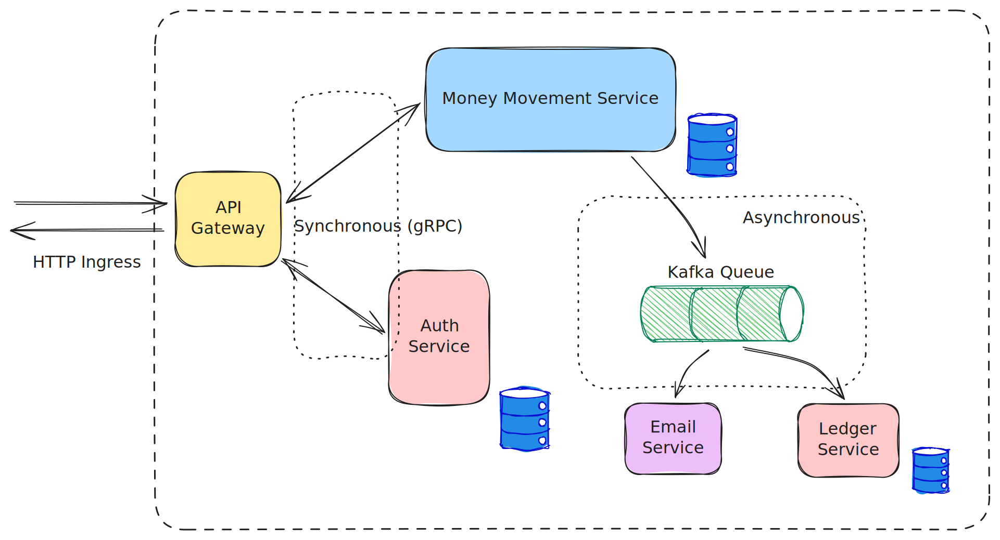

# Golang Payment Microservice

Entities:
1. Buyer
2. Merchant

Sample usage:
1. Merchant presents a QR code
2. Buyer scans the code, then enters the amount
3. Buyer proceeds to make the payment

## Architecture



* **Money Movement** service is the main service which handles the transfer of amount for payments
* **Auth** service handles authentication
* **Email** service is for sending payment notifications
* **Ledger** service can be used by the accounting department

**User flow**  
Customer payment steps:  
1. Login
2. Authorize Payment
3. Capture Payment

**Database design**

- A user is identified by `user_id` which is basically their email id.
- A user can have multiple wallets (`CUSTOMER` wallet, `MERCHANT` wallet) (in the Money Movement service).
- A `CUSTOMER` wallet has two associated `accounts`: `DEFAULT` and `PAYMENT`.
- A `MERCHANT` wallet needs to have an `INCOMING` account associated to it to receive payments.
- Money balances are maintained in `accounts`.

**Payment flow**  
(Two phase)  
1. `authorize payment` (via. `POST /customer/payment/authorize`): checks for available amount in the customer's `DEFAULT` account, then moves the amount from `DEFAULT` to `PAYMENT` account.
    - Money is not sent to the merchant's account yet.
    - A process id (`pid`) is generated to be referenced by the next step.
2. `capture payment` (via. `POST /customer/payment/capture`): moves the amount from the customer's `PAYMENT` account to the merchant's `INCOMING` account.
    - This step finalizes the payment.
    - Requires the `pid` generated from the previous step.
    - Sends messages to the message queue, and those messages are consumed by the `email` and the `ledger` services.

## Kubernetes Setup

- Use minikube https://minikube.sigs.k8s.io/docs/start/?arch=%2Fmacos%2Farm64%2Fstable%2Fhomebrew
- Start kafka with instructions here: https://strimzi.io/quickstarts/

- Mount the directory:
    ```sh
    minikube mount .:/go-payment-micro
    ```
- Start the services using `just start-services`. Stop using `just stop-services`.
    - `justfile` contains the commands to apply manifests (in `start-services` recipe), as well as commands to delete the pods (in `stop-services` recipe).

- Start ingress: `minikube tunnel`

- To view the database(s), use the command `kubectl port-forward`.
    For example, for `auth` database:
    ```sh
    kubectl port-forward -n kafka mysql-auth-abc123... 3300:3306
    ```
    Now the auth database can be accessed at port `3300`.
    Example to access using `mysql` command:
    ```sh
    mysql -h 127.0.0.1 -u auth_user -D auth -P 3300 -p
    ```
    Enter the database user's password for access.

- Swagger UI can be accessed in the browser at `http://localhost/swagger/index.html`
